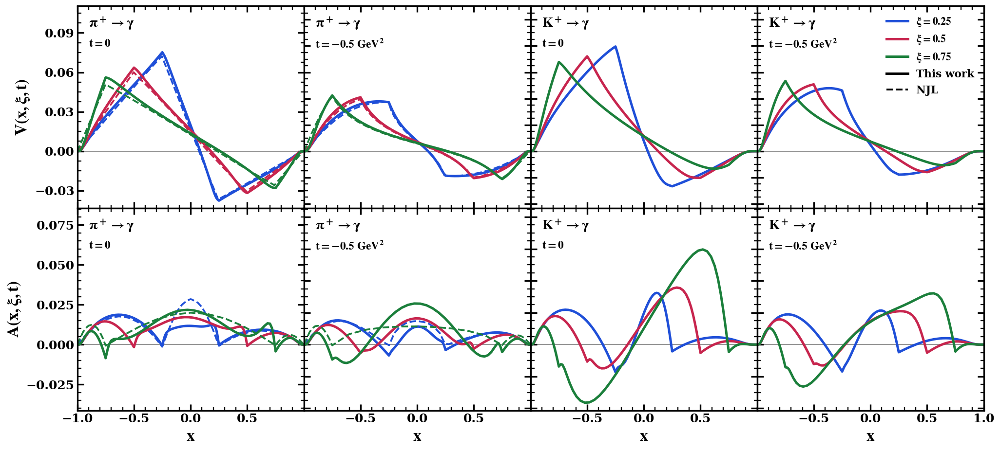
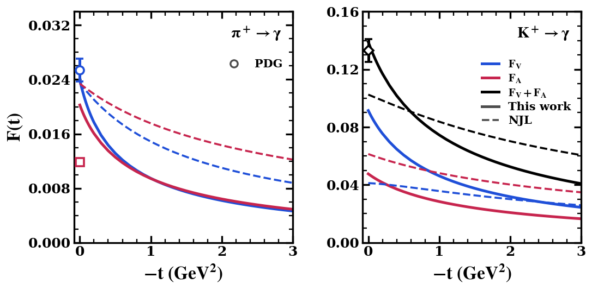
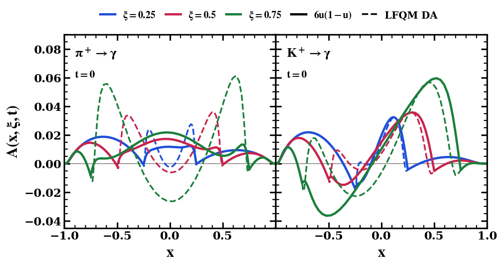
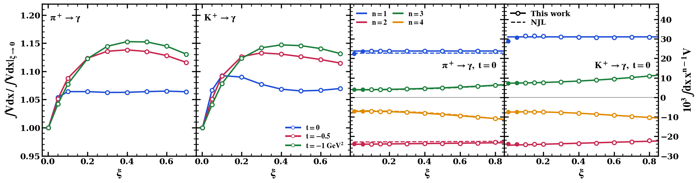

# Pion- and Kaon-to-Photon TDAs in the LFQM

**Pion- and kaon-to-photon transition distribution amplitudes in the light-front quark model**

Satyajit Puhan · Institute of Physics, Academia Sinica, Taipei

*Work in progress, paper in preparation.*

The leading-twist vector and axial π⁺ → γ and K⁺ → γ transition distribution amplitudes (TDAs) are computed in the light-front quark model. The Gaussian wave functions are the ones that describe the pion and kaon decay constants, with no adjusted parameter.

> **Please note.** If you use any of the figures or the code, please cite this repository. If you follow research ethics, I will be happy to work with you and to share the code along with the notes. Contact: puhansatyajit@gmail.com · WhatsApp +886-919 479 591

## Figures

**Vector (V) and axial (A) TDAs of the pion and kaon**

**Vector and axial form factors against −t**

**Axial TDA with the pole term subtracted**

**Covariance: ξ dependence of the moments**

---

The code is kept private for now. I will be happy to share it along with the notes.

© 2026 Satyajit Puhan. All rights reserved: the figures may not be reused without permission.
